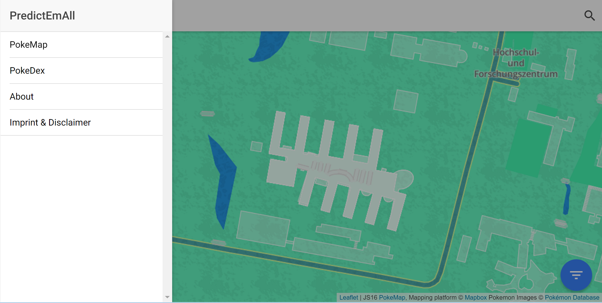
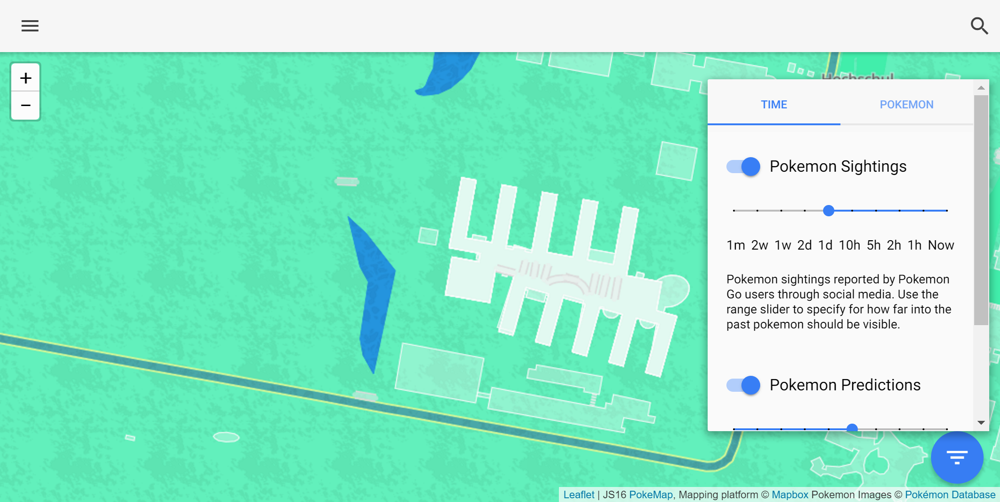
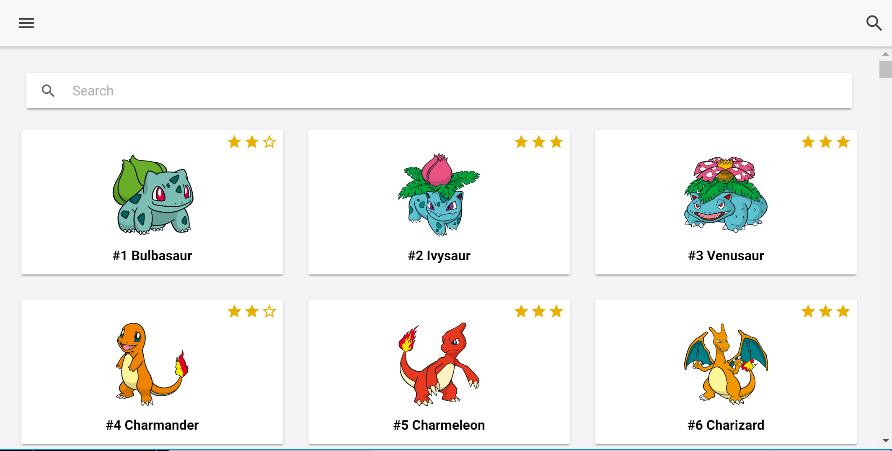
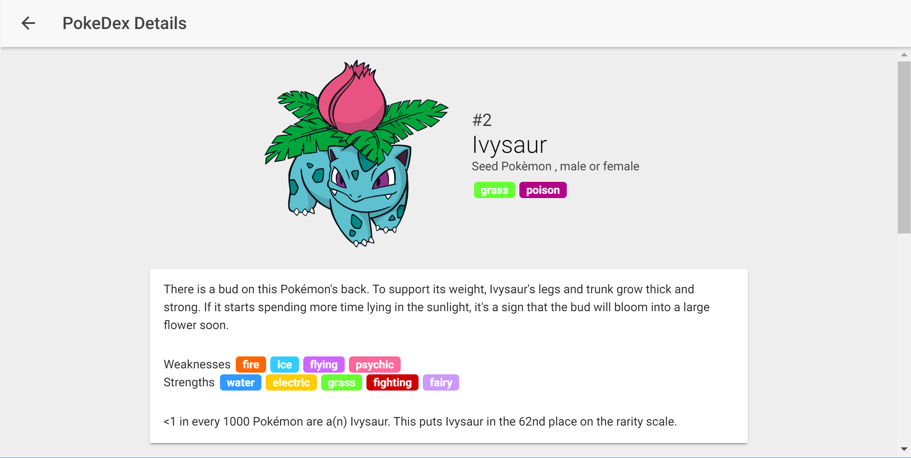

# Server-side JavaScript with Node.js Basics

# Introduction

Node.js is a JavaScript runtime environment that enables developers to build backends of sophisticated web applications. A unique characteristic that differentiates Node.js from other server-side technologies like Java is how concurrency is handled. Node.js' approach builds on the event-driven architecture of the JavaScript language. This means that a single JavaScript thread handles incoming requests. Node.js achieves this through asynchronous i/o. Instead of waiting for network requests or file system accesses to finish, the JavaScript thread continues its execution and a callback is executed once the data arrives. A single Node.js process can handle thousands of requests much more efficiently compared to the classical approach where for every request a new thread is created. Node is thus optimized for optimal throughput and scalability.

# Node.js history

**8. November 2009**

Ryan Dahl, the creator of Node.js, introduced Node.js at JSConf.eu in Berlin. On one of his first slides Ryan Dahl characterized Node.js with the following five points:

- Server-side JavaScript<br>
  Back in 2009 JavaScript was mainly used in the browser. The usage of JavaScript to build server-side applications was a novelty.
- Built on Google's V8<br>
  The V8 JavaScript engine developed by Google for its Chrome browser was at the time, and is still today, one of the fastest JavaScript engines on the market. Ryan Dahl chose to use it because V8 is open-source.
- Evented, non-blocking I/O<br>
  The way how Node.js deals with asynchronicity is one of its defining characteristics. Ryan Dahl later explained in his talk in great detail why asynchronous  i/o is important for Node.js.
- CommonJS module system<br>
  Back in 2009 the usage of a module system with JavaScript was still uncommon. Ryan Dahl chose to use the CommonJS module format for Node.js. In Node.js every file is a module and it is generally preferred to have more modules instead of long files.
- 8000+ lines of C/C++, 2000 lines of JavaScript<br>
  Ryan Dahl meant for Node.js to serve as the foundation for programs written in JavaScript. It itself is mainly written in the system programming languages C and C++. Today, much of the functionality originally written for Node.js has been extracted from the Node.js project into standalone libraries like "libuv".

The first four points are still true for Node.js as we know it today. Only the number of lines of code in point 5 has risen considerably since. It is apparent that the architectural design choices that Ryan Dahl made for Node.js back in 2009 were very solid. The video recording of Ryan Dahl's talk is available on YouTube.

**12. January 2010**

Isaac Schlueter introduced the package manager "npm". npm makes integrating third party code into Node.js projects very easy. The first versions of npm didn't ship with Node.js itself. Instead it had to be installed separately.

**10. November 2010**

Ryan Dahl passed the copyright for Node.js to his employer, the company Joyent. Node.js had risen in popularity and he felt that the project should be backed by a corporate entity.

**July 2011**

Microsoft and Joyent cooperated to make Node.js run on Windows which previously only ran on Linux and macOS. This step meant that Node.js was then available on all three major platforms.

**25. November 2011**

Node.js version 0.6.3 shipped as the first version with the package manager npm included. Node.js and npm are today inseparable projects. The inclusion of npm meant a major milestone.

**December 2014**

In late 2014 many of the main contributors became unhappy about how the Node.js open-source project was run. Releases were infrequent and the included version of the JavaScript engine V8 was outdated. For these reasons Fedor Idutny and other node contributors decided to fork the project. The resulting project was called "io.js". Contrary to Node.js, io.js had much more frequent releases and it shipped with a recent version of V8 that included new JavaScript features. Consequently io.js felt a lot fresher than Node.js.

**14. September 2015**

The introduction of io.js created a rift inside the Node.js community. Both factions weren't happy with the split in the ecosystem and they began talking to each other about how the two projects could merge once more. As a result, the Node.js Foundation was formed and in September 2015 Node.js version 4.0 shipped that combined both projects.

**Now**

Node.js is nowadays a very healthy open-source project.

- It consistently had 1-2 releases in the past months
- The Node.js Foundation has a technical steering committee that makes swift technical decisions
- npm, the package manager, has become very reliable

# Module System of Node.js

# Reasons for Using a Module System

A big server application can contain a lot of code. Having only a few, but very long files is disadventageous. Node's module system makes it very easy to have a large set of highly decoupled files with distinct functionalities. Modules can be authored individually, debugged and tested independently. This helps with team scalability, maintainability and decreases testing costs.

# CommonJS - Node's Module Format

The module format used by Node.js is called "CommonJS". This section first goes into the history of CommonJS and then how it can be used.

## Histroy

**January 2009**

CommonJS was created by the software developer Kevin Dangoor under the name "ServerJS". Kevin Dangoor's idea was to create a JavaScript environment, which is able to [include other modules, package up code and install packages for creating cleaner server-side environments](http://www.blueskyonmars.com/2009/01/29/what-server-side-javascript-needs).

**March 2009**

The CommonJS API version 0.1 with its "securable modules" was released. The basic idea behind secure modules is to have additional constraints, e.g. a module must not write to any free variables or their transitive members, it must not refer to any free variables apart from primordials (Defined by [ECMAScript](http://www.ecma-international.org/publications/standards/Ecma-262.htm) primodials are `Object`, `Array`, etc.), `require`, `environment` and `exports` and it must not tamper with or mutate the transitive primordials.

**April 2009**

CommonJS modules were shown off with several implementations at the first JSConf in Washington, DC.

**August 2009**

The group was formally renamed to CommonJS in order to reflect the broader applicability of the APIs.

**8 November 2009**

Ryan Dahl announced Node.js and that it uses CommonJS.

**26 May 2013**

Isaac Z. Schlueter wrote a statement where he explained why CommonJS is [made obsolete by Node.js and is avoided by the core Node.js developers](https://github.com/nodejs/node-v0.x-archive/issues/5132#issuecomment-15432598). Node.js needed asynchronous IO paradigms, cross-platform compatibility and streaming APIs, which CommonJS never really achieved. Another critical difference was the missing priority of performance for the CommonJS community which was one of the main priorities of Node.js. That's why Schlueter separated Node.js from the CommonJS keeping some core features like the module system from the original "securable modules".

## Usage

The module system of Node.js is easy to use. There are three scoped variables `require`, `exports` and `module`.

**require**

`require(path)` is used to import other modules.

- It can load core modules of Node.js, `.js` files as JavaScript text files, `.json` files as JavaScript Objects, `.node` files as binary add-ons and packages installed via npm.
- It caches the loaded modules. If `require()` is called with a path that has already been seen it returns the cached module. So, modules are only executed once. However, it should be noted that require treats paths case-sensitively. So, `require('./file')` and `require('./FILE')` are treated as distinct paths.

**exports**

Modules can make objects and objects and functions available to the outside by exporting them. This is done my adding them as properties on the `exports` object. Ordinary, not exported variables inside the modules cannot be accessed from the outside.

**module**

- `module.exports`: `module.exports` and `exports` are the same object. Alternatively to setting properties on the `exports` object, it is also viable to replace the object outright by setting `module.exports`. If a module should only export a single value, it is actually very common to export it by setting `module.exports` directly.
- The `module` variable also provides metadata about the module itself, e.g. it provides a `filename` property which is equivalent to `__filename`.

# npm - Node's package manager

A package manager is a tool that automates the process of installing, updating and removing packages. The package manager of Node.js is called "npm" and comes with every Node.js installation. A package is a collection of modules that aim to provide a certain functionality. The npm registry, the central repository for Node.js packages, has packages for all kinds of purposes, like web frameworks, utility libraries, etc. Notably npm itself is a package and is fully written in JavaScript. The npm registry has currently more than 300,000 packages, and about 400 new packages get added every day (Source: http://www.modulecounts.com/).

## Install Command
"npm" is controlled using a command line interface (CLI). The most important command is `npm install`:
* __npm install__
  This looks up all packages defined in the *package.json* file and installs them and all their dependencies. Packages are installed into the *node_modules* folder of the current project.
* __npm install <packagename>__
  This installs the specified package and all its dependencies into the current project.
* __npm install -s <packagename>__
  This installs the specified package into the current project and adds it to the *package.json* file.
* __npm install -g <packagename>__ installs a package globally into a system-wide destination. Use this for packages that should accessible on the Command Line (e.g. *gulp <task> <othertask>*).

## npm Scripts
npm is also widely used for automating recurring tasks. This can be accomplished by defining so called "scripts" in the *package.json* file. The following shows an example definition of scripts for the *start* and *test* commands:
```JS
{ ...,
  "scripts": {
    "start": "node lib/main",
    "test": "node tests/main && standard"
  }, ...
}
```

These scripts can then be executed using `npm start` and `npm test`. [npm's website](https://docs.npmjs.com/cli/npm) documents all standardized script hooks. It is also possible to define arbitrarily named scripts which can be called by running `npm run-script <scriptname>`.

## Other Commands

Besides the afore mentioned commands, npm has a plethora of other commands, like `npm init`, `npm update`, `npm prune` and `npm publish`. For more information on those visit [npm's website](https://docs.npmjs.com/cli/npm).

# Excellent ES2015 support in Node.js

The objective of this section is to highlight the good support for modern JavaScript in Node.js.

## ES2015

"ES" stands for "ECMAScript". "ECMA" is the standards body that standardizes JavaScript. "ECMAScript" is the official name of JavaScript and the name refers to the language inside the standard. "ES2015", formerly called "ES6", introduces many new features to the language. In recent months the version of V8 included with Node.js began to support more and more ES2015 features. According to the feature test on  [kangax.github.io](http://kangax.github.io/compat-table/es6/) Node.js version 6 supports 92% of the ES2015 specification.

## 7 useful ES2015 features

In the following persents 7 useful ES2015 features for Node.js development.

### Property Shorthand

```JS
const name = 'Max Mustermann'
const age = '67'

// Old
const person = { name: name, age: age }

// New
const person = { name, age }
```

The property shorthand is an object literal enhancement that makes it less verbose to define properties that have the same name as a variable.

### Method Definition Shorthand

```JS
// Old
const obj = {
  hello: function hello () { console.log('hello') }
}

// New
const obj = {
  hello () { console.log('hello') }
}

obj.hello()
```

This object literal enhancement makes the definition of methods on an object briefer.

### Arrow functions

```JS
// Old
let studentNames = students.map(function (s) { return s.name })

// New
let studentNames = students.map(s => s.name)
```

Arrow functions represent a new syntax for defining functions. The arrow function syntax is less verbose than the traditional function literal. For instance the example above shows how omitting the curly braces around the function body works as an implied return statement. Another useful feature of arrow functions is that they preserve the `this` of the outer scope which is useful for defining callbacks.


### Classes

```JS
class Student extends Person {
  constructor (name, university) {
  super(name)
    this._university = university
  }

  get university () { return this._university }
}
```

ES2015 introduces a new syntax for defining classes. It should be noted that the new class syntax is just an alternative syntactical way for defining classes in JavaScript. Under the hood ES2015 classes work with the same prototypal inheritance system that JavaScript always had.


### Promises
```JS
const fs = require('fs-promise')

fs.readFile('hello.text')
  .then(buffer => { ... })
  .catch(error => { ... })
```

Node.js traditionally uses callbacks for asynchronicity. ES2015 introduces an alternative mechanism called "promises". A promise is an object that represents an eventual value. The advantage of promises is that they, since they are objects, can be returned as a return value by functions. Also, promises provide a robust way for error handling which reduces the risk for bugs inside error handling code.

### Destructuring Assignment
```JS
// Old
function processPerson (options) {
  console.log(options.name, options.age)
}

// New
function processPerson ({ name, age }) {
  console.log(name, age)
}
```

In Node.js it is quite frequent that a function accepts a single "options" object as parameter instead of having multiple parameters. ES2015 introduces a convenient way for extracting values from such an object and introduce them as variables inside the function.

Destructuring also works with arrays and in other places like variable declarations and assignment statements.

### Default Parameter Values

```JS
function inviteToParty (name = 'Max Mustermann') {
...
}
```

Default parameters provide a convenient way to assign values to variables that would otherwise be `undefined`. Note that default values can also be used in destructuring patterns like the one seen in the previous example.

## Conclusion

Node.js version 6 has good support for modern JavaScript. The ES2015 features highlighted above have in common that they can improve code quality by enhancing clarity and reducing verbosity.

# Pracitical Example: Unit testing with Mocha

This section serves as a practical example of how programming in Node.js looks like. We'll be using CommonJS modules, npm and also some modern JavaScript features presented in the previous sections.

Doing unit testing is good practice in programming projects. In Node.js projects it is also common practice to have unit tests. All major packages in the npm registry employ unit testing to ensure correct behavior. Luckily unit testing is very easy in Node.js. This section illustrates how to use the `mocha` testing framework and the `chai` assertion library.

## Project Setup

Create a project folder with a `package.json` inside. It you can use a test editor or use `npm init` to create the `package.json` file.

## Installation

Use `npm install --save mocha chai` to install `mocha` and `chai` as packages within the project.

## package.json Script
``` JS
{
  "name": "testing-demo",
  "scripts": {
    "test": "mocha test/**/*.js" // Add this
  },
  "dependencies": {
    "chai": "^3.5.0",
    "mocha": "^3.0.2"
  }
}
```

Add `"mocha test/**/*.js"` as the test script in your `package.json`. `test/**/*.js` is a glob pattern. It means "Select all `.js` files inside the `test/` directory". We can use `mocha` as a command because we installed `mocha` as a local package in the previous step.

## Create a Module with Tests

Create `lib/hello-world.js` with the following content:

```JS
module.exports = function helloWorld () {
  return 'hello world!'
}
```

The above module exports a single function which returns a string.

Create `test/hello-world.js` with the following content:

``` JS
const helloWorld = require('../lib/hello-world')
require('chai').should() // Chai

describe('helloWorld()', function () { // Mocha
  it('returns "hello world!"', () => { // Mocha
    helloWorld().should.equal('hello world!') // Chai
  })
})
```

The comments indicate whether the line uses functionality provided by the testing framework `mocha` or by the assertion library `chai`. The `should` mechanism is one of three different notations supported by the `chai` assertion library (Technical note: `should()` adds a `should` property on `Object.prototype` to make this work).

## Run It

Use `npm test` to run the test.

## Conclusion

This section showcased how working with Node.js commonly looks like by demonstrating how to do unit testing. More information and documentation about `mocha` and `chai` can be found on their respective project websites.

To conclude let it be said that it is most beneficial to create tests parallel to the development of a feature's functionality. The creation of a plethora of tests beforehand is usually impractical because the tests are frequently rendered obsolete as a result of the project evolving into a different direction. Also, it is not recommended to create the unit tests afterwards because treating testing as an afterthought usually leads to bad test coverage.

# Useful npm Packages

  All of the following packages can be installed with `npm install` in front of their name.

**Testing**

- `mocha` in conjunction with `chai`
- `jasmine-node`

**Style checking**

Linters are tools for enforcing a code style rules. The following packages enforce common code style rules:
- `standard` (without semicolons)
- `semistandard` (with semicolons)

**Utilities**

Reinventing the wheel isn't necessary by using:
- `lodash` for various utility functions
- `request` to perform HTTP requests
- `fs-promise` Node's `fs` module promisified

**Read and Write Excel files**

Import your Excel files and manipulate their data using JavaScript:

```JS
const XLSX = require('xlsx')
const workbook = XLSX.readFile('test.xlsx')
...
```

**Web Framework**

One of the most used packages for creating server applications is `express`. With only three lines of code you can create and start your own server:

```JS
const express = require('express')
const app = express()
app.listen(3000)
```

**Build Tools**

These packages let you define tasks for all your frontend development needs like transpiling, concatenating, minimizing, linting and obfuscation:

- `grunt`
- `gulp`
- `broccoli`

**Databases**

Simple solutions for using databases are provided by:
- `mongoose` (MongoDB)
- `bookshelf` (PostgreSQL, MySQL, SQLite3)

**And many more**

NPM has currently over 320,000 packages and over 400 are added every day.

# Project

Our project was to create a mobile-first website that provides information to [Pokemon Go](http://www.pokemongo.com/) players. This website shows Pokemon sightings and predicted sightings in the near future as well as PokeMobs (large gatherings of Pokemon Go players) on a map. Additionally it provides information about the Pokemon, like their attributes, as well as a sentiment analysis based on what users say on twitter.

## Overview
The website consists of the following basic parts which will be explained in the upcoming sections:
* **Sidebar** for navigating through the app
* **PokeMap** shows the map with sightings, predictions and mobs
* **PokeDex** lists an overview of all Pokemon
* **PokeDetail** providing all detailed information about a Pokemon
* **About page**
* **Imprint & Disclaimer**

## Sidebar
The sidebar enables navigating through the app by providing links to the **PokeMap**, the **PokeDex**, the **About page** and the **Imprint & Disclaimer** page.



## PokeMap
The PokeMap is screen showing a map with current Pokemon sightings, Pokemon predictions and PokeMobs. Additionally you can:
* Search for a location or a Pokemon
* Filter by Time and/or Pokemon
* Show a detail sheet for a Pokemon-Sighting/Prediction/PokeMob



## PokeDex
The PokeDex shows a list of Pokemon including some of their attributes like name, number and rarity. Additionally it enables you to search for pokemon and open a Pokemon PokeDetail page.



## PokeDetail

The PokeDetail page shows all relevant information about a Pokemon, including:
* Name and number of Pokemon
* Description, types, weaknesses and strengths
* Attributes (like weight, flee rate, ...) and evolution
* Possible attacks

And additionally a sentiment analysis based on data extracted from [Twitter](https://www.twitter.com).



## About page
This page provides background information about the project and a list of all the contributors.


## Imprint & Disclaimer
This page shows legal information about the project.
